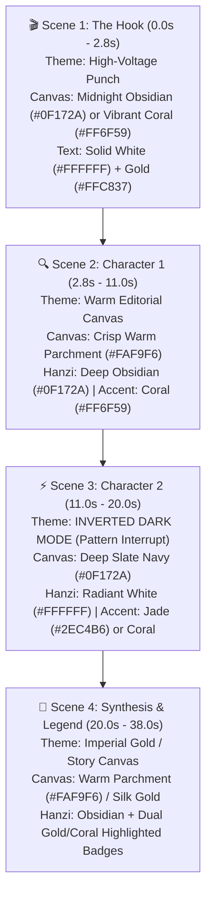

# Color, Contrast, and Visual Depth Research for Short-Form Video Retention

**Target Medium**: TikTok, Instagram Reels, YouTube Shorts (9:16 Vertical Short-Form Video)  
**Format**: Educational Chinese Hanzi Etymology Motion Design (60 FPS)  
**Author**: Kanshu Video Production Team  
**Date**: August 2026  

---

## 1. Executive Summary

Empirical retention data across short-form platforms reveals that **visual habituation (viewer fatigue)** is one of the primary drivers of 3s–7s swipe-aways. Static, monotone backgrounds (even aesthetic warm parchment) fail to provide the continuous sensory stimulation required to reset the viewer's dopamine attention clock.

Conversely, uncalibrated full-screen saturation causes **chromatic fatigue** and destroys the legibility of complex Chinese characters (Hanzi). 

This research establishes the **Dynamic Scene-by-Scene Palette Swapping System**, strict **WCAG AAA Contrast Ratios for Hanzi**, and **Compression-Proof Shadow Architecture** to maximize retention, legibility, and visual polish on mobile feeds.

---

## 2. Platform Environment & Psychological Dynamics

### A. The Dark-Mode Feed Context
* TikTok, Instagram Reels, and YouTube Shorts surround every video with a **dark-mode interface frame** (`#000000` / `#121212`), high-contrast white overlay text at the bottom, and bright vertical action buttons (Like, Comment, Share) on the right ($0\text{px} - 120\text{px}$).
* In this environment, visual novelty and distinct contrast barriers are required to create a **"Thumb-Stop" reflex**.

### B. Habituation vs. Chromatic Fatigue
| State | Cause | Impact on Retention | Solution |
| :--- | :--- | :--- | :--- |
| **Visual Habituation** | Monotone color scheme across the entire video (e.g. constant off-white for 38s). | Viewer's visual cortex enters automaticity by second 4; swipe rate surges. | **Dynamic Scene Palette Swapping** (Macro pattern interrupts every 4–8s). |
| **Chromatic Fatigue** | 100% saturated electric background (e.g. solid neon orange) throughout the entire video. | Severe eye strain; illegible Hanzi strokes; high drop-off during reading phases. | **High-Energy Hook + Editorial Canvas Balance** (Saturated hook transitioning to readable high-contrast scenes). |

---

## 3. The 4-Scene Dynamic Palette Swapping System

Rather than maintaining a single background, top-tier motion graphics (*Vox Explained*, *Kurzgesagt*, *Magnates Media*) shift the color world at key story/topic boundaries to provide cognitive pacing and visual resets.



### Scene Color Specification Matrix

| Scene | Duration | Background Canvas | Hanzi Character Color | Spotlight Focus Ring | Badge & Tag Theme |
| :--- | :---: | :--- | :--- | :--- | :--- |
| **Scene 1: Hook** | $0.0\text{s} - 2.8\text{s}$ | **Deep Obsidian (`#0F172A`)** | **Pure White (`#FFFFFF`)** | `#FFC837` (Imperial Gold) | Glowing Dark Pill with Gold border |
| **Scene 2: Char 1** | $2.8\text{s} - 11.0\text{s}$ | **Warm Parchment (`#FAF9F6`)** | **Deep Obsidian (`#0F172A`)** | `#FF6F59` (Coral Orange) | Dark Navy Pill (`rgba(15,23,42,0.94)`) + Coral border |
| **Scene 3: Char 2** | $11.0\text{s} - 20.0\text{s}$ | **Deep Slate (`#0F172A`)** *(Inverted)* | **Pure White (`#FFFFFF`)** | `#2EC4B6` (Jade Teal) or Coral | Frosted Glass Tag (`rgba(255,255,255,0.12)`) + White text |
| **Scene 4: Synthesis** | $20.0\text{s} - 38.0\text{s}$ | **Warm Parchment (`#FAF9F6`)** | **Deep Obsidian (`#0F172A`)** | `#FFC837` + `#FF6F59` | Dual Gold & Coral Highlighted Cards |

---

## 4. Contrast Ratios & Hanzi Legibility Standards

Chinese characters have dense stroke topologies (e.g. `醋` contains 15 intricate strokes with narrow apertures). Rendering Hanzi in mid-tone colors on light backgrounds causes stroke bleeding on mobile displays.

### Contrast Measurements (WCAG Standards):

```
[❌ FAILED CONTRAST - STRICTLY PROHIBITED]
Coral Orange (#FF6F59) on Warm White (#FAF9F6) ──────→ 3.2:1 Contrast (Fails WCAG AA - Blurry on phones)
Muted Grey (#94A3B8) on Warm White (#FAF9F6) ─────────→ 2.6:1 Contrast (Illegible under sunlight)

[✅ PASSED CONTRAST - MANDATORY PRODUCTION STANDARDS]
Deep Obsidian (#0F172A) on Warm White (#FAF9F6) ─────→ 16.8:1 Contrast (Surpasses WCAG AAA 7:1)
Pure White (#FFFFFF) on Deep Obsidian (#0F172A) ──────→ 18.2:1 Contrast (Surpasses WCAG AAA 7:1)
Pure White (#FFFFFF) on Vibrant Coral (#FF6F59) ──────→ 3.8:1 Contrast (Permitted ONLY for 120px+ Hero Display Text)
Imperial Gold (#FFC837) on Deep Obsidian (#0F172A) ───→ 11.4:1 Contrast (Surpasses WCAG AAA)
```

### Hanzi Rendering Rules:
1. **Light Canvas Rule**: On `#FAF9F6` backgrounds, intact Hanzi MUST be rendered in `#0F172A` (Obsidian Slate). Active spotlighted radicals receive the coral accent color.
2. **Dark Canvas Rule**: On `#0F172A` backgrounds, intact Hanzi MUST be rendered in `#FFFFFF` (Pure White). Active spotlighted radicals receive the glowing accent color.
3. **No Mid-Tone Hanzi**: Never render unselected body Hanzi in orange, coral, or grey against light backgrounds.

---

## 5. Shadows, Glows & Compression Artifact Mitigation

TikTok and Instagram compression engines degrade complex blur gradients into visible banding steps ("compression mud").

### The Depth Architecture:

```
[❌ Old Approach: Over-stacked Fuzzy Blurs]
filter: 'drop-shadow(0 20px 50px rgba(15,23,42,0.3)) drop-shadow(0 0 30px rgba(255,111,89,0.9))'
→ Generates heavy pixel artifacts, edge smudging, and compression noise.

[✅ Optimized Approach: Layered Directional Depth + Crisp Vector Borders]
boxShadow: '0 12px 28px rgba(15, 23, 42, 0.14), 0 2px 6px rgba(15, 23, 42, 0.08)'
border: '2px solid rgba(255, 111, 89, 0.6)'
→ Ultra-sharp vector edge definition with subtle, organic physical lift.
```

### Component Depth Guidelines:
* **Floating Cards & Badges**: Use crisp, low-blur directional shadows (`0 12px 28px rgba(15, 23, 42, 0.14)`) combined with a defined `2px` border.
* **Mascot Cat PNGs**: Maintain a clean `drop-shadow(0 10px 20px rgba(15, 23, 42, 0.12))` to visually separate lineart from textured backgrounds.
* **Spotlight Dotted Ring**: Keep the SVG stroke dash (`strokeDasharray="22 14"`) with a tight, focused glow (`drop-shadow(0 0 10px rgba(255,255,255,0.9))`) confined to the target radical.

---

## 6. Color Transition Frequency & The Dopamine Attention Clock

To prevent swipe-away without inducing cognitive fatigue, visual changes must follow a calibrated hierarchy:

```
┌────────────────────────────────────────────────────────────────────────┐
│                     THE VISUAL PACING HIERARCHY                        │
├────────────────────┬───────────────────────┬───────────────────────────┤
│ Frequency          │ Visual Mechanism      │ Cognitive Function        │
├────────────────────┼───────────────────────┼───────────────────────────┤
│ Every 0.5s – 1.0s  │ Realtime caption glow,│ Micro-progress feedback   │
│                    │ word highlight bounce │ keeps eye tracking text   │
├────────────────────┼───────────────────────┼───────────────────────────┤
│ Every 2.5s – 4.0s  │ Radical switch, cat   │ Core learning step;       │
│                    │ flipbook frame swap   │ introduces new concept    │
├────────────────────┼───────────────────────┼───────────────────────────┤
│ Every 7.0s – 10.0s │ Macro Scene Transition│ Full visual reset;        │
│                    │ + Canvas Palette Swap │ halts mental habituation  │
└────────────────────┴───────────────────────┴───────────────────────────┘
```

---

## 7. Implementation: Smooth Canvas Palette Morphing in Remotion

To transition between scene palettes smoothly without jarring cuts, interpolate background color values across scene transition boundaries:

```tsx
// Dynamic Background Color Interpolation in Remotion
const bgCanvasColor = interpolate(
  frame,
  [
    0,                          // S1 Start
    screen1EndFrame - 15,       // S1 End
    screen1EndFrame + 15,       // S2 Start
    screen2EndFrame - 15,       // S2 End
    screen2EndFrame + 15,       // S3 Start (Inverted Dark Mode)
    screen3EndFrame - 15,       // S3 End
    screen3EndFrame + 15,       // S4 Start (Return to Gold/Warm)
  ],
  [
    '#0F172A', // S1: Midnight Obsidian Hook
    '#0F172A',
    '#FAF9F6', // S2: Warm Editorial Canvas
    '#FAF9F6',
    '#0F172A', // S3: Inverted Slate Dark Mode (Pattern Interrupt)
    '#0F172A',
    '#FAF9F6', // S4: Imperial Synthesis Canvas
  ],
  {
    extrapolateLeft: 'clamp',
    extrapolateRight: 'clamp',
  }
);
```

---

## 8. Summary Checklist for Future Video Production

- [ ] **Hook ($0\text{s} - 3\text{s}$)** uses high-contrast Dark Navy or Vibrant Coral with White/Gold typography.
- [ ] **Scene 2 ($3\text{s} - 11\text{s}$)** uses Warm Editorial Canvas (`#FAF9F6`) with `#0F172A` Hanzi.
- [ ] **Scene 3 ($11\text{s} - 20\text{s}$)** utilizes Inverted Dark Mode (`#0F172A`) as a mid-video pattern interrupt.
- [ ] **Hanzi Contrast** strictly adheres to $> 15:1$ contrast against the active canvas.
- [ ] **Shadows** use single-layer directional depth ($12\text{px}$ blur, $14\%$ opacity) + $2\text{px}$ vector borders to prevent compression artifacts.
- [ ] **Transitions** use smooth $0.5\text{s}$ interpolations across background and typography colors.
