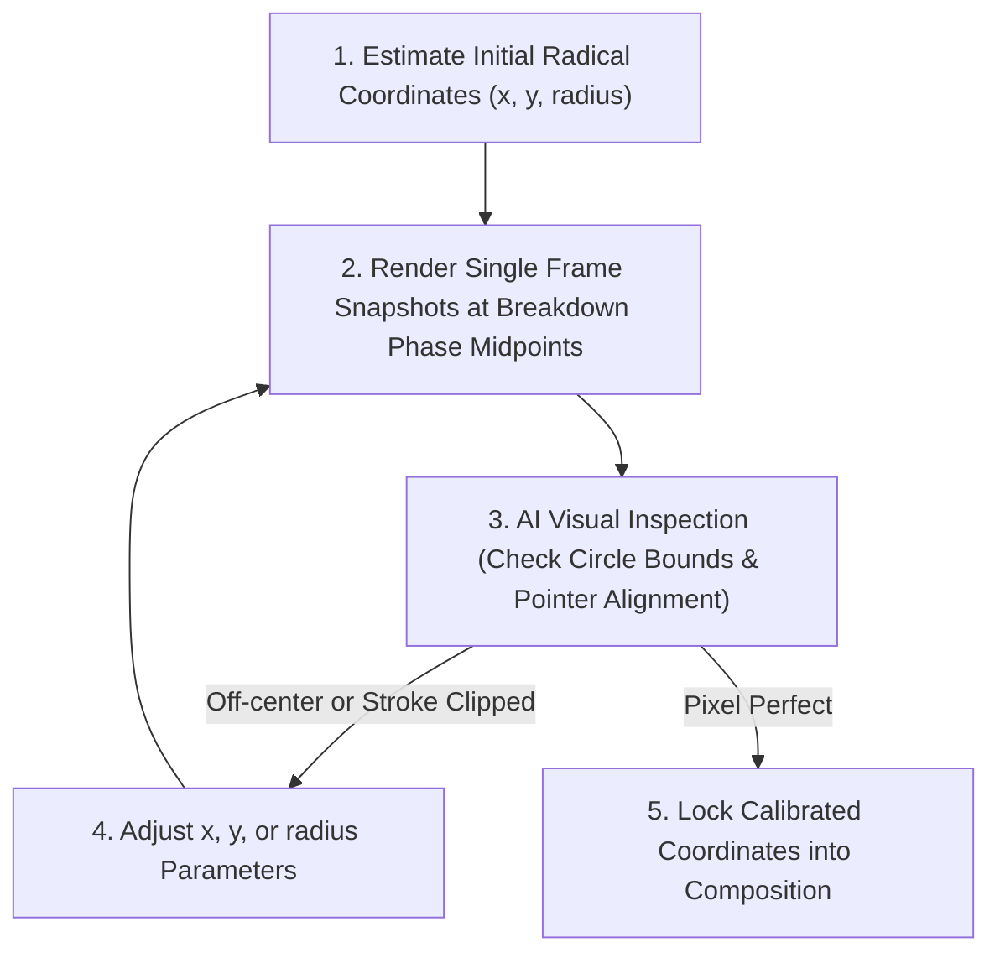

# Chinese Character Etymology Video Workflow & Automation Master Guide

This document captures the **complete end-to-end architecture, voice prompting secrets, cat sketch flipbook prompting pipeline, spotlight calibration visual inspection loop, timing alignment algorithms, visual animation mechanics, design tokens, music specifications, transition physics, and message-by-message feedback analysis** for producing Chinese Character Etymology videos for **Kanshu**.

---

## 1. Video Architecture & Composition Structure

Videos are rendered as 9:16 vertical reels (1080 x 1920) at 60 FPS in Remotion. A full etymology lesson consists of **5 distinct scenes**:

```
+-------------------------------------------------------------------------------+
|  1. HOOK / INTRO (0s - ~8.5s)                                                 |
|     - Title: "Why Does 帮助 Contain Cloth & Muscle?"                          |
|     - Intact centered Hanzi: 帮助                                             |
|     - 4 Orbiting Radical Emojis (bouncy spring pop-ins on mention)            |
|     - Flipbook Cat Card 1: 🤝 帮助 (bāng zhù)                                 |
+-------------------------------------------------------------------------------+
|  2. CHARACTER 1 BREAKDOWN: 帮 (bāng) (~8.5s - ~29.4s)                         |
|     - Title: "Character 1: 帮 (bāng) — Protective Backing"                    |
|     - Intact 帮 morphs to center; 助 slides off-screen right                  |
|     - Dynamic Black Spotlight: 邦 (top) -> 巾 (bottom) -> 帮 (whole)          |
|     - Flipbook Cat Cards: 🏰 邦 -> 🧵 巾 -> 🛡️ 帮                           |
+-------------------------------------------------------------------------------+
|  3. CHARACTER 2 BREAKDOWN: 助 (zhù) (~29.4s - ~48.7s)                         |
|     - Title: "Character 2: 助 (zhù) — Muscle Power"                           |
|     - Intact 帮 slides off-screen left; 助 morphs to center                   |
|     - Dynamic Black Spotlight: 且 (left) -> 力 (right) -> 助 (whole)          |
|     - Flipbook Cat Cards: ⛩️ 且 -> 💪 力 -> 🏋️ 助                           |
+-------------------------------------------------------------------------------+
|  4. SYNTHESIS / CONCLUSION (~48.7s - ~54.0s)                                  |
|     - Title: "Synthesis: 帮助 = Protection + Muscle!"                        |
|     - 帮 and 助 morph side-by-side inside glowing Synthesis Aura Ring         |
|     - Sequential highlight: 帮 (orange) -> 助 (orange)                        |
|     - Flipbook Cat Card: 🤝 帮助 (bāng zhù)                                 |
+-------------------------------------------------------------------------------+
|  5. KANSHU APP PROMOTIONAL OUTRO (~54.0s - ~61.1s)                            |
|     - 3D iPhone canvas with live book text & Pinyin ruby annotations          |
|     - Animated touch ripple gesture pointer                                   |
|     - Badges: Apple App Store (Google Play Store commented out)               |
|     - Primary CTA: "Start Reading For Free — Link in Bio"                     |
+-------------------------------------------------------------------------------+
```

---

## 2. Dynamic Target Spotlight Coordinate Calibration Loop (Visual AI Inspection)

Chinese characters have diverse structural decompositions (Top-Bottom splits like `帮`, Left-Right splits like `助`, or Surround enclosures like `国`). **Do NOT guess coordinate values!** Always execute the **Spotlight Coordinate Calibration Loop**:



### Calibration Procedure & Target Coordinates:
1. **Estimate Initial Coordinates**: Set local $(x, y)$ inside the 600px Hanzi container.
   - **Top-Bottom Character (`帮`)**:
     - Top Radical `邦`: `spot2Y = 210`, `radius = 120`
     - Bottom Radical `巾`: `spot2Y = 430`, `radius = 120`
     - Whole Character `帮`: `spot2Y = 300`, `radius = 230`
   - **Left-Right Character (`助`)**:
     - Left Radical `且`: `spot3X = 390`, `radius = 120`
     - Right Radical `力`: `spot3X = 620`, `radius = 120`
     - Whole Character `助`: `spot3X = 540`, `radius = 230`

2. **Render Frame Snapshots**: Render PNG snapshots at the midpoint frame of each radical phase:
   ```bash
   npx remotion render src/index.ts EtymologyBangzhu out/calib_top_bang.png --frame=600
   npx remotion render src/index.ts EtymologyBangzhu out/calib_bottom_jin.png --frame=1000
   npx remotion render src/index.ts EtymologyBangzhu out/calib_left_qie.png --frame=2000
   ```

3. **Visual AI Inspection**: Inspect the generated PNGs to verify:
   - The black dashed circle smoothly bounds the exact radical strokes without clipping.
   - The pointer arrow `👇` is snug against the circle border (`top: -(radius - 15)`).

---

## 3. Design System Tokens: Colors, Typography & Font Usage Rules

### A. Color Palette (`COLORS`)
- **Background Canvas**: `#FAF9F6` (Warm off-white paper canvas from brand guidelines).
- **Primary Brand Accent**: `#FF6F59` (Vibrant Coral Orange/Red). Used for active word highlights, CTA buttons, spotlight rings, and header borders.
- **Dark Pill / Mask Overlay**: `#0F172A` (Deep Slate Navy). Used for dynamic target spotlight background (`rgba(15, 23, 42, 0.95)`) and dark card tags.
- **Card Subtitle / Pinyin**: `#94A3B8` (Cool Grey).
- **Ruby Inactive Pinyin**: `#8E8E93` (Muted Grey).

### B. Typography & Font Assignment Rules

| Font Family | Variable / Constant | Purpose & Usage Rules |
| :--- | :--- | :--- |
| **Finger Paint** | `FONTS.display` | **All English Headings & Display Callouts**. Use ONLY for top brand badges (`CHINESE CHARACTER ETYMOLOGY`), screen title headers, card tag translation labels (ALL CAPS), and primary CTA buttons. |
| **Noto Sans SC** | `"Noto Sans SC"` | **All Chinese Hanzi Characters**. ALWAYS use for main intact morphing Hanzi (`fontSize: 340px`, weight `900`), card tag Hanzi (`fontSize: 40px`, weight `900`), and reader book text. |
| **Roboto** | `FONTS.pinyin` | **Pinyin Pronunciation & Subtitles**. ALWAYS use for Pinyin annotations in card tags (`fontSize: 28px`, italic, weight `700`), subtitles, and real-time speech captions. |

---

## 4. Background Music, Pattern & Motion Systems

### A. Royalty-Free Chinese Lofi Background Music
- **Audio File**: `public/chinese_lofi_bgm.mp3` (Jade Tea Loop).
- **Volume Level**: **8% volume** (`volume={0.08}`) during the etymology lesson sequence.
- **Fade-Out Transition**: Fades out smoothly in the last 60 frames (1 second) before the outro:
```tsx
const bgmFadeOut = interpolate(frame, [lessonDurationInFrames - 60, lessonDurationInFrames], [1, 0], {
  extrapolateLeft: 'clamp',
  extrapolateRight: 'clamp',
});
const bgmVolume = 0.08 * bgmFadeOut;
```

### B. Oriental Cloud Lattice Background (`ChineseBackground.tsx`)
- **Texture Asset**: `public/chinese_cloud_pattern.png` (Traditional Chinese oriental cloud lattice vector pattern).
- **Visual Style**: Subtle 18% opacity overlay over the `#FAF9F6` warm canvas.
- **Drift Motion**: Continuous horizontal parallax drift at 0.05px per frame (`transform: translateX(${frame * 0.05}px)`).
- **Subtle Background Mesh Grid**: Quadratic moving grid slide (`backgroundSize: '54px 54px'`, opacity 0.28).

---

## 5. Screen Transition Physics & Morphing Patterns

Screen transitions use fluid Remotion spring physics (`SPRING_SMOOTH`: `damping: 22, mass: 0.9, stiffness: 120`).

### A. Morphing Character Coordinates ($X$ Position & Scale)
Intact Hanzi characters **morph continuously** across screens:

$$\text{morph1To2} = \text{spring}(\text{frame} - \text{screen1EndFrame})$$
$$\text{morph2To3} = \text{spring}(\text{frame} - \text{screen2EndFrame})$$
$$\text{morph3To4} = \text{spring}(\text{frame} - \text{screen3EndFrame})$$

- **Character 1 (`帮`) Position ($X$)**:
  - Screen 1: $-150\text{px}$ (Left side of compound word).
  - Screen 2: $0\text{px}$ (Center focus, scaled up to $1.4\times$).
  - Screen 3: $-800\text{px}$ (Slides completely off-screen left).
  - Screen 4: $-150\text{px}$ (Morphs back to left side of synthesis aura ring).

- **Character 2 (`助`) Position ($X$)**:
  - Screen 1: $+150\text{px}$ (Right side of compound word).
  - Screen 2: $+800\text{px}$ (Slides completely off-screen right).
  - Screen 3: $0\text{px}$ (Center focus, scaled up to $1.4\times$).
  - Screen 4: $+150\text{px}$ (Morphs back to right side of synthesis aura ring).

### B. Card Tag Entrance & Exit Transitions (`OrganicCenterTag.tsx`)
- **Entrance**: Moves from left off-screen ($-1400\text{px} \rightarrow 0\text{px}$) with gentle overshoot spring (`damping: 18, mass: 0.8, stiffness: 140`).
- **Exit**: Moves off-screen right ($0\text{px} \rightarrow +1400\text{px}$) when `frame >= exitFrame`.

---

## 6. Flipbook Cat Sketch Generation & Consistency Pipeline

### A. Card Tag Label Styling
- **Pill Container**: `backgroundColor: '#0F172A'`, `padding: '14px 38px'`, `borderRadius: 26px`, `border: '2px solid rgba(255, 111, 89, 0.5)'`, `boxShadow: '0 16px 40px rgba(15, 23, 42, 0.45)'`.
- **Line 1**: Emoji (`38px`) + Hanzi (`40px`, Noto Sans SC `#FFFFFF`, 900 weight) + Pinyin (`28px`, Roboto `#94A3B8`, 700 weight italic).
- **Line 2**: Translation (`22px`, Finger Paint `#FF6F59`, 700 weight, ALL CAPS).

### B. 3-Frame Consistent Image-to-Image Generation Sequence

1. **Master Prompt Anchor**:
   > `"Minimalist hand-drawn black ink line art sketch of a cute chubby round cat [ACTION], simple black stroke on pure solid white background, cute cartoon doodle style, clear black outline, no color fill, no shading."`

2. **Frame 1 (Base Anchor)**: Generate Frame 1 using the Master Prompt.
3. **Frame 2 & 3 (Image-to-Image Seed Anchoring)**: Pass **Frame 1** as the reference input image with a low variation weight (**0.25 – 0.35**) to lock cat proportions, face shape, and stroke width while prompting micro-actions.
4. **Absolute 6 FPS Ping-Pong Loop**:
```tsx
const cycleIndex = Math.floor(frame / 10) % 4;
const pingPongMap = [0, 1, 2, 1]; // 0 -> 1 -> 2 -> 1 loop
const flipIndex = pingPongMap[cycleIndex] % catImages.length;
const currentCatSrc = catImages[flipIndex] || catImages[0];
```

---

## 7. ElevenLabs Voiceover Specifications

- **Voice Model**: `eleven_v3` (Voice ID `tnSpp4vdxKPjI9w0GnoV`).
- **Syntax Rule**: Character + Inline Pinyin Syntax `帮助 (bāngzhù)`.
- **Single-Pass Recording**: Generated in 1 request using `with-timestamps` API.
- **Pace Acceleration**: `ffmpeg -filter:a "atempo=1.15"` (15% faster speech pace).

---

## 8. Full Reusable Source Code Architecture

### A. Background Component (`ChineseBackground.tsx`)
```tsx
import React from 'react';
import { AbsoluteFill, interpolate, staticFile } from 'remotion';

export interface ChineseBackgroundProps {
  frame: number;
  lessonTotalFrames?: number;
  morph1To2?: number;
  morph2To3?: number;
  morph3To4?: number;
}

export const ChineseBackground: React.FC<ChineseBackgroundProps> = ({
  frame,
  lessonTotalFrames = 2772,
  morph1To2 = 0,
  morph2To3 = 0,
  morph3To4 = 0,
}) => {
  const enterProgress = Math.min(1, Math.max(0, frame / 35));
  const enterOpacity = Math.pow(enterProgress, 2);

  const exitStartFrame = lessonTotalFrames - 45;
  const exitProgress = Math.min(1, Math.max(0, (frame - exitStartFrame) / 45));
  const exitOpacity = Math.pow(1 - exitProgress, 2);

  const totalOpacity = enterOpacity * exitOpacity;
  const enterY = (1 - enterProgress) * (1 - enterProgress) * 50;

  const continuousPanY = frame * 0.4;
  const transitionPanX =
    interpolate(morph1To2, [0, 1], [0, 60]) +
    interpolate(morph2To3, [0, 1], [0, -100]) +
    interpolate(morph3To4, [0, 1], [0, 50]);

  const patternScale =
    1.0 +
    interpolate(morph1To2, [0, 1], [0, 0.05]) +
    interpolate(morph2To3, [0, 1], [0, -0.06]) +
    interpolate(morph3To4, [0, 1], [0, 0.05]);

  if (totalOpacity <= 0.001) return null;

  return (
    <AbsoluteFill
      style={{
        opacity: totalOpacity * 0.12,
        transform: `translateY(${enterY}px) scale(${patternScale})`,
        pointerEvents: 'none',
        zIndex: 1,
        overflow: 'hidden',
      }}
    >
      <div
        style={{
          position: 'absolute',
          top: -200,
          left: -200,
          width: 'calc(100% + 400px)',
          height: 'calc(100% + 400px)',
          backgroundImage: `url(${staticFile('chinese_cloud_pattern.png')})`,
          backgroundRepeat: 'repeat',
          backgroundSize: '950px auto',
          backgroundPosition: `${transitionPanX}px ${-continuousPanY}px`,
        }}
      />
    </AbsoluteFill>
  );
};
```

### B. Python Sync Script (`sync_single_pass_config.py`)
```python
#!/usr/bin/env python3
import os
import sys
import json
import argparse
import subprocess

def get_audio_duration(file_path):
    cmd = ['ffprobe', '-v', 'error', '-show_entries', 'format=duration', '-of', 'default=noprint_wrappers=1:nokey=1', file_path]
    res = subprocess.run(cmd, stdout=subprocess.PIPE, stderr=subprocess.PIPE, text=True)
    try:
        return float(res.stdout.strip())
    except ValueError:
        return 0.0

def sec_to_frame(sec, fps=60):
    return int(round(sec * fps))

def main():
    parser = argparse.ArgumentParser(description="Sync single-pass alignment with config.json and optional speed factor")
    parser.add_argument('--speed', type=float, default=1.15)
    parser.add_argument('--audio', default='public/bangzhu_voice_single_pass_fast.mp3')
    parser.add_argument('--config', default='content/04_etymology_bangzhu/config.json')
    parser.add_argument('--alignment', default='public/bangzhu_voice_single_pass_alignment.json')
    args = parser.parse_args()

    speed_factor = args.speed
    with open(args.alignment, 'r') as f:
        align = json.load(f)

    chars = align.get('characters', [])
    starts = align.get('character_start_times_seconds', [])
    ends = align.get('character_end_times_seconds', [])

    raw_words_alignment = []
    current_word_chars = []
    word_start = None
    word_end = None

    for c, s, e in zip(chars, starts, ends):
        if c in [' ', '\n', '\t']:
            if current_word_chars:
                w_str = ''.join(current_word_chars).strip()
                if w_str:
                    raw_words_alignment.append({"word": w_str, "start": word_start, "end": word_end})
                current_word_chars = []
                word_start = None
                word_end = None
        else:
            if word_start is None:
                word_start = s
            word_end = e
            current_word_chars.append(c)

    words_alignment = [{"word": wa['word'], "start": round(wa['start']/speed_factor, 3), "end": round(wa['end']/speed_factor, 3)} for wa in raw_words_alignment]

    audio_duration = get_audio_duration(args.audio)
    total_frames = sec_to_frame(audio_duration)

    with open(args.config, 'r') as f:
        cfg = json.load(f)

    cfg['audioSrc'] = os.path.basename(args.audio)
    cfg['wordsAlignment'] = words_alignment
    cfg['lessonDurationInFrames'] = total_frames

    with open(args.config, 'w') as f:
        json.dump(cfg, f, indent=2, ensure_ascii=False)

    print(f"✅ Successfully updated {args.config} with {speed_factor}x speed alignment!")

if __name__ == '__main__':
    main()
```

---

## 9. Message-by-Message Feedback Analysis

| Step | User Request / Feedback | Root Cause | Engineering Solution |
| :--- | :--- | :--- | :--- |
| **1** | Use Pinyin using v3 | Speech engine skipped Chinese characters when unguided. | Switched to `eleven_v3`. |
| **2** | Cut audio according to timestamps | Dual pronunciations occurred when stitching snippets. | Switched to single-pass master recording. |
| **3** | Character + Pinyin prompt engineering | Passing `帮助 (bāngzhù)` forced single native Mandarin pronunciation. | Adopted `帮助 (bāngzhù)` character+pinyin prompt format. |
| **4** | Refactor animation timelines | Hardcoded frame numbers made audio updates difficult. | Created `sync_single_pass_config.py` to write `animationTimestamps` to `config.json`. |
| **5** | Faster speech track | 1.0x narration felt slow for Reels/TikTok. | Applied `ffmpeg atempo=1.15` and `--speed 1.15` alignment scaling. |
| **6** | Comment out Play Store in outro | Google Play Store app not available yet. | Commented out Google Play Store badge in `AppOutro.tsx`. |
| **7** | Incoherent flipbook animations | Relative frame indexing caused phase offsets & visual snapping. | Implemented global absolute 6 FPS ping-pong loop `[0, 1, 2, 1]`. |
| **8** | Concurrency 8 is super slow | CPU thread thrashing on macOS. | Reverted to standard default Remotion thread concurrency. |
| **9** | Target Spotlight Radical Inspection Loop | Visual calibration required to prevent circle stroke clipping. | Documented Visual AI Inspection Loop & coordinate mapping for Top/Bottom & Left/Right radicals. |
