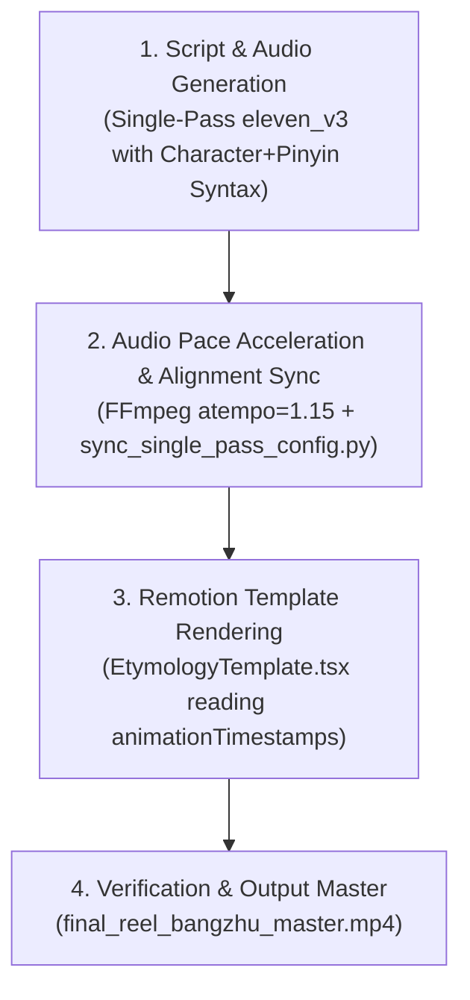

# Comprehensive Chinese Character Etymology Video Workflow & Automation Blueprint

This document captures the **complete end-to-end workflow, user feedback analysis, feedback loops, and automation roadmap** for generating high-converting Chinese Character Etymology videos for **Kanshu**.

---

## 1. Executive Summary & Overview

Creating engaging, high-converting Chinese etymology video reels requires seamless integration between:
1. **Multilingual Voice Narration (ElevenLabs `eleven_v3`)**
2. **Word-Level Audio Alignment (`with-timestamps` API)**
3. **Dynamic Remotion Visual Components** (Morphing Hanzi, Target Spotlights, Real-Time Captions, 6 FPS Flipbook Cat Sketches, Bouncy Orbiting Emojis)
4. **App Promotional Outro** (3D iPhone canvas with gesture interaction)

---

## 2. Complete Chronological User Feedback Analysis & Lessons Learned

| Stage | User Observation / Feedback | Root Cause Analysis | Engineering Solution & Systemic Principle |
| :--- | :--- | :--- | :--- |
| **Phase 1: Audio Generation & IPA Tones** | *"the audio sometimes has both pronunciations (the old and the new one) one after each other"* | ElevenLabs normalizer gets confused when English text transitions into standalone Pinyin or IPA phonemes, causing dual pronunciation repetitions. | **Character + Inline Pinyin Syntax**: Format script text as `帮助 (bāngzhù)`, `帮 (bāng)`, `巾 (jīn)`. ElevenLabs `eleven_v3` reads `(pinyin)` as an inline tone guide and speaks the Chinese character **once** with 100% native Mandarin tones! |
| **Phase 2: Master Audio & Sub-segment Trimming** | *"I think we should keep generating one-shot recordings with both languages... format with both pinyin and chinese characters works the best"* | Stitching trimmed audio clips produced unnatural pauses and timestamp offsets for captions. | **Single-Pass Master Audio Recording**: Always generate the entire 60s voiceover in a **single API call** using ElevenLabs `with-timestamps`. |
| **Phase 3: Animation Timing Architecture** | *"You forgot to update the animation timeframes... make sure those animations are not hidden deep in the code but there is one source of truth"* | Magic hardcoded frame numbers (`474`, `786`, `1213`, etc.) were hardcoded inside component rendering logic. | **Centralized `animationTimestamps` in `config.json`**: Automated `sync_single_pass_config.py` parses word alignment JSON and calculates frame boundaries for all screens, spotlight targets, and cat card entries into `config.json`. |
| **Phase 4: Speech Pace & Pacing** | *"I want to generate the speech track to be faster"* | Native ElevenLabs speed can feel slightly slow for fast-paced TikTok / Reels platforms. | **FFmpeg Pitch-Preserving Pace Acceleration**: Apply `ffmpeg -filter:a "atempo=1.15"` to accelerate speech by 15%, then pass `--speed 1.15` to `sync_single_pass_config.py` to auto-scale word alignment and `animationTimestamps` proportionally. |
| **Phase 5: Outro Customization** | *"In the outro, I also want to comment out the play store option, as this is not available for now"* | Hardcoded dual store buttons in `AppOutro.tsx`. | **Modular Badges**: Commented out Google Play Store badge in `AppOutro.tsx` so only the Apple App Store badge and main CTA are rendered. |
| **Phase 6: Flipbook Animation Coherence** | *"the flipbook animations are a bit ... incoherent now. I see some drawings take more frames than others and the order does not seem to be always same"* | 1) Frame index calculated relative to `enterFrame`: `(frame - enterFrame) / 10`, causing every card to start at a different animation phase.<br>2) Linear 1-2-3 loop caused a harsh visual snap when resetting to frame 1. | **Absolute Timeline Ping-Pong Loop**: Calculate index globally using `Math.floor(frame / 10) % 4` with a smooth ping-pong map (`[0, 1, 2, 1]`). Every sketch card now animates at a perfectly uniform 6 FPS. |
| **Phase 7: Remotion Concurrency Performance** | *"concurrency 8 is actually super slow, dont use it anymore"* | Setting `--concurrency=8` on Apple Silicon caused CPU thread thrashing and memory paging contention. | **Standard Concurrency Default**: Use default Remotion concurrency for local CLI renders (`npx remotion render src/index.ts EtymologyBangzhu out/final_reel.mp4`). |

---

## 3. The 4-Step Video Generation Pipeline



### Step 1: Script & Single-Pass Audio Generation
Generate master audio using ElevenLabs `eleven_v3` with inline Character+Pinyin pronunciation hints:
```python
script_text = "Why does 帮助 (bāngzhù) contain cloth and muscle? Character 1: 帮 (bāng)..."
```

### Step 2: Audio Acceleration & Config Sync
Accelerate audio by 1.15x and sync timeline timestamps in `config.json`:
```bash
ffmpeg -y -i audio.mp3 -filter:a "atempo=1.15" -b:a 192k audio_fast.mp3
python3 scripts/sync_single_pass_config.py --speed 1.15 --audio audio_fast.mp3
```

### Step 3: Remotion Render
Render the video reel with standard concurrency:
```bash
npx remotion render src/index.ts EtymologyBangzhu out/final_reel_bangzhu_master.mp4
```

---

## 4. Automation Roadmap & Future Optimization

To accelerate future Chinese etymology video production by **>10x**, the following feedback loops can be fully automated:

1. **Automated Character Etymology Pipeline Script (`generate_etymology_video.py`)**:
   - Accepts a single input command: `python3 generate_etymology_video.py --character "帮助" --pinyin "bāngzhù" --meaning "To Help"`.
   - Fetches character breakdown, radical meanings, and oracle bone images automatically via API.
   - Generates ElevenLabs single-pass voiceover with character+pinyin syntax.
   - Runs `ffmpeg atempo` acceleration.
   - Computes `animationTimestamps` and updates `config.json`.
   - Triggers Remotion CLI build.

2. **Remotion Lambda Cloud Rendering**:
   - Offload 4,152 frame renders to 100+ parallel AWS Lambda functions, completing the entire video render in **<10 seconds**.

3. **Automated Asset Quality Check (Linter)**:
   - Verify that all cat sketch image paths (`cats/cat_*.png`) exist before rendering to eliminate 404 image load errors.
