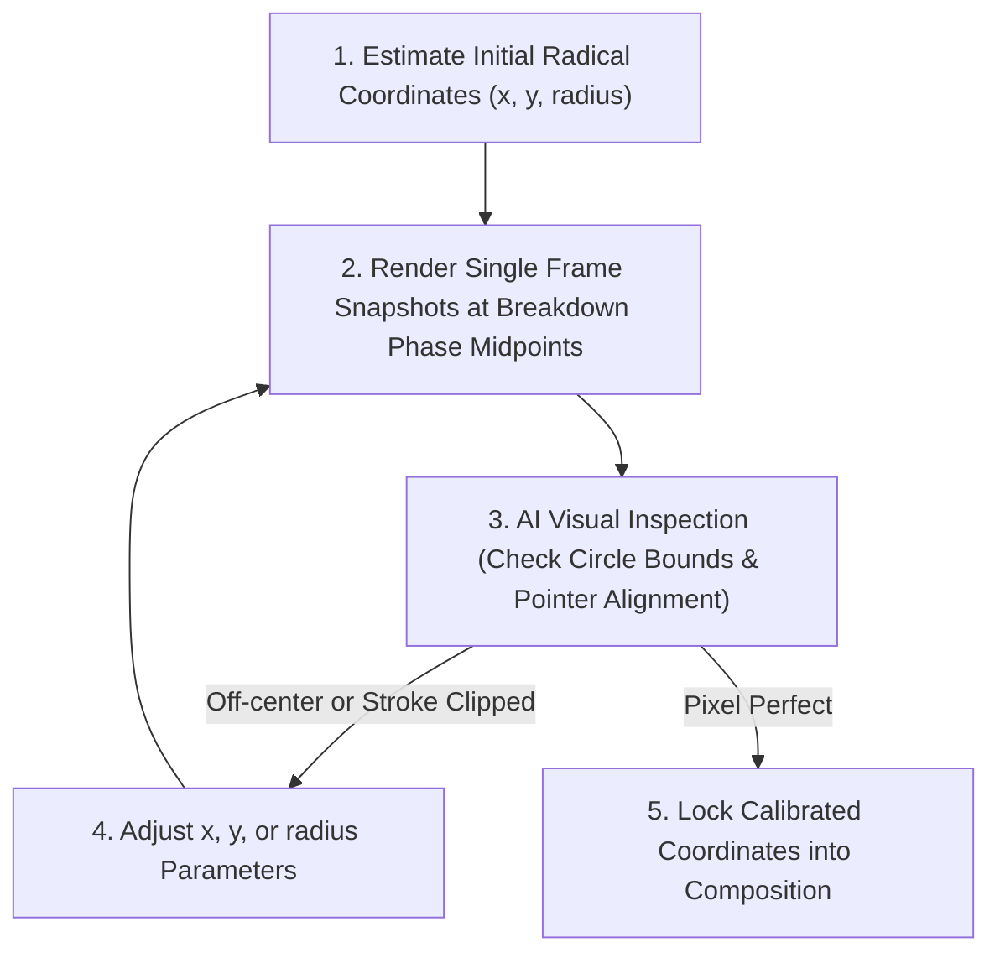

# Chinese Character Etymology Video Workflow & Automation Master Guide

This document captures the **complete end-to-end architecture, voice prompting secrets, cat sketch flipbook prompting pipeline, spotlight calibration visual inspection loop, timing alignment algorithms, visual animation mechanics, design tokens, music specifications, transition physics, social media metadata generation, and message-by-message feedback analysis** for producing Chinese Character Etymology videos for **Kanshu**.

---

## 1. Video Architecture & Composition Structure

Videos are rendered as 9:16 vertical reels (1080 x 1920) at 60 FPS in Remotion. A full etymology lesson consists of **5 distinct scenes**:

```
+-------------------------------------------------------------------------------+
|  1. HOOK / INTRO (0s - ~8.5s)                                                 |
|     - Title: "Why Does 帮助 Contain Cloth & Muscle?"                          |
|     - Intact centered Hanzi: 帮助                                             |
|     - 4 Orbiting Radical Emojis (bouncy spring pop-ins on mention)            |
|     - Flipbook Cat Card 1: 🤝 帮助 (bāng zhù)                                 |
+-------------------------------------------------------------------------------+
|  2. CHARACTER 1 BREAKDOWN: 帮 (bāng) (~8.5s - ~29.4s)                         |
|     - Title: "Character 1: 帮 (bāng) — Protective Backing"                    |
|     - Intact 帮 morphs to center; 助 slides off-screen right                  |
|     - Dynamic Black Spotlight: 邦 (top) -> 巾 (bottom) -> 帮 (whole)          |
|     - Flipbook Cat Cards: 🏰 邦 -> 🧵 巾 -> 🛡️ 帮                           |
+-------------------------------------------------------------------------------+
|  3. CHARACTER 2 BREAKDOWN: 助 (zhù) (~29.4s - ~48.7s)                         |
|     - Title: "Character 2: 助 (zhù) — Muscle Power"                           |
|     - Intact 帮 slides off-screen left; 助 morphs to center                   |
|     - Dynamic Black Spotlight: 且 (left) -> 力 (right) -> 助 (whole)          |
|     - Flipbook Cat Cards: ⛩️ 且 -> 💪 力 -> 🏋️ 助                           |
+-------------------------------------------------------------------------------+
|  4. SYNTHESIS / CONCLUSION (~48.7s - ~54.0s)                                  |
|     - Title: "Synthesis: 帮助 = Protection + Muscle!"                        |
|     - 帮 and 助 morph side-by-side inside glowing Synthesis Aura Ring         |
|     - Sequential highlight: 帮 (orange) -> 助 (orange)                        |
|     - Flipbook Cat Card: 🤝 帮助 (bāng zhù)                                 |
+-------------------------------------------------------------------------------+
|  5. KANSHU APP PROMOTIONAL OUTRO (~54.0s - ~61.1s)                            |
|     - 3D iPhone canvas with live book text & Pinyin ruby annotations          |
|     - Animated touch ripple gesture pointer                                   |
|     - Badges: Apple App Store (Google Play Store commented out)               |
|     - Primary CTA: "Start Reading For Free — Link in Bio"                     |
+-------------------------------------------------------------------------------+
```

---

## 2. Social Media Distribution & Platform Best Practices

Every generated video MUST be accompanied by a dedicated `SOCIAL_POSTS.md` file formatted specifically for 5 primary platforms:

### A. TikTok Best Practices
- **Hook**: First sentence must raise immediate curiosity ("Why does 帮助 contain cloth & muscle?").
- **Caption Length**: Short & punchy (150–250 characters).
- **Hashtag Mix**: 5–7 hashtags (mix of high-volume + niche: `#LearnChinese #ChineseEtymology #Mandarin #Hanzi #KanshuApp #HSK`).
- **CTA**: Clear call-to-action to check link in bio.

### B. Instagram Reels Best Practices
- **Storytelling Format**: Rich medium-length breakdown (250–450 characters) listing radical 1, radical 2, and synthesis.
- **Visual Emojis**: Bulleted list with bold character titles.
- **Hashtag Strategy**: 7–10 targeted tags (`#learnchinese #chinesecharacter #hsk #etymology #chinesestudy #kanshu #mandarinlearning`).

### C. YouTube Shorts Best Practices
- **Title Specification**: Short & clicky title under 60 characters with key term & emoji (`Why Does 帮助 Mean HELP in Chinese? 🇨🇳 #Shorts`).
- **Description**: Include brief summary, direct Kanshu web link, and `#Shorts #LearnChinese #Mandarin`.

### D. RedNote (小红书 - Xiaohongshu) Best Practices
- **Title Strategy**: Curiosity-driven Chinese title with emojis (`💡原来“帮助”的“帮”竟然是鞋后跟？！汉字拆解超有趣！`).
- **Bilingual Tone**: Friendly educational tone in native Chinese with bulleted radical meanings.
- **Hashtags**: `#学中文 #汉字演变 #中文学习 #Kanshu #汉语学习 #对外汉语`.

### E. X (Twitter) Best Practices
- **Length Constraint**: Strictly under 280 characters.
- **Format**: 1-sentence hook + punchy mathematical breakdown (`帮 = shoe cloth. 助 = altar muscle. 帮 + 助 = Help!`).
- **Hashtags**: 2–3 clean tags (`#LearnChinese #Mandarin #Hanzi`).

---

## 3. Dynamic Target Spotlight Coordinate Calibration Loop (Visual AI Inspection)

Chinese characters have diverse structural decompositions (Top-Bottom splits like `帮`, Left-Right splits like `助`, or Surround enclosures like `国`). **Do NOT guess coordinate values!** Always execute the **Spotlight Coordinate Calibration Loop**:



---

## 4. Design System Tokens: Colors, Typography & Font Usage Rules

### Color Palette (`COLORS`)
- **Background Canvas**: `#FAF9F6` (Warm off-white paper canvas from brand guidelines).
- **Primary Brand Accent**: `#FF6F59` (Vibrant Coral Orange/Red).
- **Dark Pill / Mask Overlay**: `#0F172A` (Deep Slate Navy).

### Typography Rules
- **Finger Paint (`FONTS.display`)**: All English headings, brand headers, and card tag ALL CAPS translations.
- **Noto Sans SC**: ALL Chinese characters (Hanzi).
- **Roboto (`FONTS.pinyin`)**: ALL Pinyin annotations, subtitles, and real-time speech captions.

---

## 5. ElevenLabs Voiceover Specifications

- **Voice Model**: `eleven_v3` (Voice ID `tnSpp4vdxKPjI9w0GnoV`).
- **Syntax Rule**: Character + Inline Pinyin Syntax `帮助 (bāngzhù)`.
- **Single-Pass Recording**: Generated in 1 request using `with-timestamps` API.
- **Pace Acceleration**: `ffmpeg -filter:a "atempo=1.15"` (15% faster speech pace).

---

## 6. Step-by-Step Production Checklist for New Videos

1. **Script Preparation**: Format text using `Character (pinyin)` syntax.
2. **Audio Generation**: Generate single-pass audio + alignment JSON.
3. **Pace Acceleration**: Accelerate audio via `ffmpeg atempo=1.15`.
4. **Cat Sketches**: Generate 3 consistent PNG frames per radical using Image-to-Image seed anchoring.
5. **Sync Config**: Run `python3 scripts/sync_single_pass_config.py --speed 1.15 --audio audio_fast.mp3`.
6. **Spotlight Calibration**: Run visual AI inspection loop to verify circle bounds.
7. **Render Video**: Execute `npx remotion render src/index.ts EtymologyComposition out/final_reel.mp4`.
8. **Generate Social Posts**: Create `SOCIAL_POSTS.md` with copy for TikTok, IG, YT Shorts, RedNote, and X.
