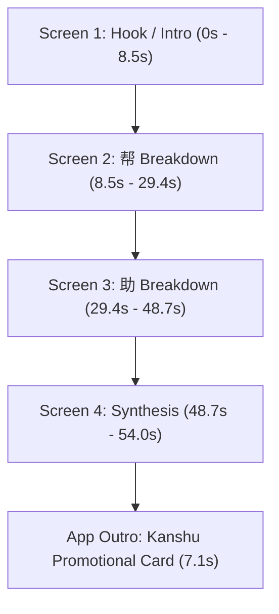

# Chinese Etymology Video Documentation: 帮助 (bāngzhù)

This document provides a complete technical and visual breakdown of the Chinese Character Etymology video generated for **帮助 (bāngzhù)**.

---

## 📽 Master Video Output
- **File**: [`engine/out/final_reel_bangzhu_master.mp4`](file:///Users/peterridilla/Documents/fun/kanshu/videos/engine/out/final_reel_bangzhu_master.mp4)
- **Duration**: ~54 Seconds (3,666 frames @ 60 FPS)
- **Dimensions**: 1080 x 1920 (Vertical 9:16 Shorts / Reels Format)

---

## 🎨 Content & Structural Breakdown

The video is divided into **4 main screens** followed by the **App Promotional Outro**:

### 1. Screen 1: Hook & Radical Preview (Frames 0 – 508 / 0.0s – 8.5s)
- **Heading**: `"Why Does 帮助 Contain Cloth & Muscle?"`
- **Main Characters**: Centered intact compound word **`帮助`** (`bangX: -150`, `zhuX: 150`).
- **Animations**:
  - **Orbiting Emojis**: 4 key radical emojis (`🏰` 邦 Territory, `🧵` 巾 Cloth, `⛩️` 且 Altar, `💪` 力 Muscle) rotate gracefully around `帮助`.
  - **Word-Synced Pop-Ins**: As the narrator mentions each component ("cloth", "wall", "altar", "muscles"), the corresponding emoji triggers a bouncy scale spring expansion (`1.0 -> 1.55`) and glowing orange drop-shadow.
  - **Center Tag**: Dark card tag `🤝 帮助 (bāng zhù) — Mutual Assistance & Protection` with a 3-frame flipbook cat sketch animation loop.

### 2. Screen 2: Character 1 Breakdown — 帮 (bāng) (Frames 508 – 1,763 / 8.5s – 29.4s)
- **Heading**: `"Character 1: 帮 (bāng) — Protective Backing"`
- **Main Character Focus**: Smooth spring morph moves **`帮`** to center stage (`scale: 1.4`), while **`助`** slides gracefully off-screen to the right (`zhuX: 800`).
- **Animations & Target Spotlight**:
  - **Phase 1: Top Radical 邦** (Frames 508 – 952): Black dynamic spotlight targets the top component `邦` (`spot2Y: 210`, `radius: 120`). Card tag displays `🏰 邦 (bāng) — Territory & Community`.
  - **Phase 2: Bottom Radical 巾** (Frames 952 – 1,440): Spotlight smoothly transitions down to `巾` (`spot2Y: 430`, `radius: 120`). Card tag displays `🧵 巾 (jīn) — Reinforcing Cloth Strip`.
  - **Phase 3: Whole Character 帮** (Frames 1,440 – 1,763): Spotlight expands to cover the entire character `帮` (`spot2Y: 300`, `radius: 230`). Card tag displays `🛡️ 帮 (bāng) — Protective Shoe Backing`.

### 3. Screen 3: Character 2 Breakdown — 助 (zhù) (Frames 1,763 – 2,920 / 29.4s – 48.7s)
- **Heading**: `"Character 2: 助 (zhù) — Muscle Power"`
- **Main Character Focus**: Smooth morph slides **`帮`** off-screen to the left (`bangX: -800`), while **`助`** moves into center focus (`scale: 1.4`).
- **Animations & Target Spotlight**:
  - **Phase 1: Intro 助** (Frames 1,763 – 1,962): Spotlight focuses on whole `助`.
  - **Phase 2: Left Radical 且** (Frames 1,962 – 2,233): Spotlight targets left side `且` (`spot3X: 390`, `radius: 120`). Card tag displays `⛩️ 且 (zhǔ) — Heavy Altar Pedestal`.
  - **Phase 3: Right Radical 力** (Frames 2,233 – 2,625): Spotlight transitions right to `力` (`spot3X: 620`, `radius: 120`). Card tag displays `💪 力 (lì) — Muscle Power & Labor`.
  - **Phase 4: Whole Character 助** (Frames 2,625 – 2,920): Spotlight expands over full `助` (`spot3X: 540`, `radius: 230`). Card tag displays `🏋️ 助 (zhù) — Lending Teamwork Strength`.

### 4. Screen 4: Etymology Synthesis (Frames 2,920 – 3,241 / 48.7s – 54.0s)
- **Heading**: `"Synthesis: 帮助 = Protection + Muscle!"`
- **Main Characters**: Both **`帮`** and **`助`** morph back into side-by-side view inside a glowing orange **Synthesis Aura Ring** (`width: 660, height: 440`).
- **Animations**:
  - **Sequential Highlight**: First **`帮`** highlights in glowing red-orange, followed by **`助`**.
  - **Center Tag**: `🤝 帮助 (bāng zhù) — Mutual Assistance & Protection`.

### 5. App Promotional Outro (Frames 3,241 – 3,666 / 54.0s – 61.1s)
- **Visuals**: Realistic 3D iPhone frame displaying Kanshu reader app interface with live touch tap gesture animation.
- **Badges & CTA**: Apple App Store badge + `"Start Reading For Free — Link in Bio"` CTA button in Finger Paint font. *(Google Play Store badge commented out for now).*

---

## 🎵 Audio Assets & Pacing

| Asset | Path | Description |
| :--- | :--- | :--- |
| **Speech Narration** | `public/bangzhu_voice_single_pass_fast.mp3` | ElevenLabs `eleven_v3` voiceover with 1.15x pace acceleration (~54 sec). Uses character+pinyin syntax `帮助 (bāngzhù)` for native Mandarin tone accuracy. |
| **Background Music** | `public/chinese_lofi_bgm.mp3` | Royalty-free Chinese Lofi (Jade Tea Loop) set at 8% volume across lesson and outro. |
| **Outro Audio** | `public/kanshu_outro_elevenlabs.mp3` | ElevenLabs promotional voiceover for Kanshu app outro. |

---

## 🐱 Flipbook Cat Sketch Animations

All cat sketch cards use **transparent borderless PNGs** with an **absolute ping-pong frame loop (`0 -> 1 -> 2 -> 1`)** at 6 FPS (10 video frames per sketch step):

- `cats/cat_bangzhu_word_frame_1.png`, `frame_2.png`, `frame_3.png`
- `cats/cat_bang_top_frame_1.png`, `frame_2.png`, `frame_3.png`
- `cats/cat_bang_bottom_1.png`, `frame_2.png`, `frame_3.png`
- `cats/cat_bang_whole_frame_1.png`, `frame_2.png`, `frame_3.png`
- `cats/cat_zhu_left_frame_1.png`, `frame_2.png`, `frame_3.png`
- `cats/cat_zhu_right_frame_1.png`, `frame_2.png`, `frame_3.png`
- `cats/cat_zhu_whole_1.png`

---

## ⚙️ Configuration Files & Code Locations

- **Central Config**: [`content/04_etymology_bangzhu/config.json`](file:///Users/peterridilla/Documents/fun/kanshu/videos/content/04_etymology_bangzhu/config.json)
- **Main React Template**: [`engine/src/templates/EtymologyTemplate.tsx`](file:///Users/peterridilla/Documents/fun/kanshu/videos/engine/src/templates/EtymologyTemplate.tsx)
- **Outro Component**: [`engine/src/components/AppOutro.tsx`](file:///Users/peterridilla/Documents/fun/kanshu/videos/engine/src/components/AppOutro.tsx)
- **Sync & Timeline Script**: [`engine/scripts/sync_single_pass_config.py`](file:///Users/peterridilla/Documents/fun/kanshu/videos/engine/scripts/sync_single_pass_config.py)
